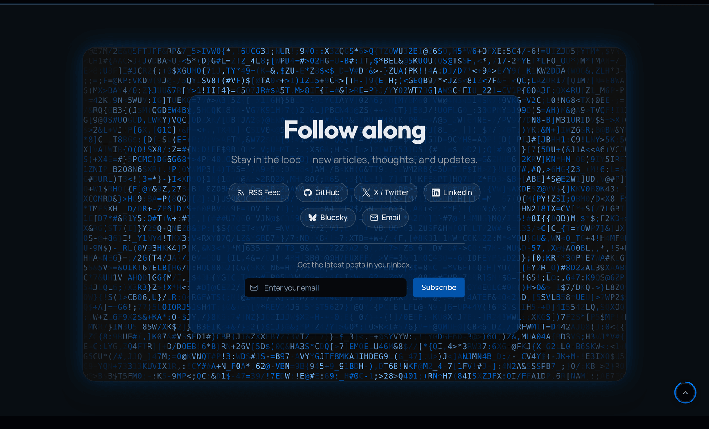

Every post on your blog is worth reading twice — once when someone finds it, and once when they come back. An RSS link helps the people who use a reader. A newsletter reaches everyone else.

[Astro Rocket](https://astrorocket.dev) ships a newsletter signup for exactly that: a form component, an API endpoint, and a place for it in the blog. It is **off by default**, and this post covers what it does, how to switch it on, and how to put the form wherever you want it.

## What you get

Two pieces, both already in the theme:

- **`NewsletterForm`** — the signup component, in `src/components/patterns/NewsletterForm.astro`.
- **`POST /api/newsletter`** — the endpoint it posts to, in `src/pages/api/newsletter.ts`. It validates the address and adds it as a contact to a [Resend](https://resend.com) audience.

Turn the feature on and the form appears in the *follow along* section — the block at the foot of the blog index and of every post that already offers your RSS feed, your social links and your email address. The newsletter joins that list rather than becoming another section competing with it.



On a phone the same section drops the glass card, and the field and the button stack to the full width of the screen.

## Why it is off by default

The endpoint needs a Resend API key and an audience. Without them it answers *"Newsletter service is not configured"* and the visitor sees an error.

A signup box that fails on submit is worse than no signup box, and most people who clone a starter theme do not have a mailing list on day one. So the theme ships the feature complete and switched off. You turn it on when you have somewhere for the addresses to go.

## How to switch it on

### Step 1 — Create a Resend audience

Sign up at [resend.com](https://resend.com) — the free tier is plenty for a personal blog. You need two values from the dashboard:

- **An API key**, under **API Keys**. This is the same key the theme's contact form uses, so if your contact form already works you have it.
- **An audience ID**, under **Audiences**. Create an audience, open it, and copy its ID.

### Step 2 — Set the environment variables

For **local development**, add both to the `.env` file at your project root:

```bash
RESEND_API_KEY=your-resend-api-key
RESEND_AUDIENCE_ID=your-audience-id
```

For **production on Vercel**, open **Settings → Environment Variables** and add the same two names and values. Netlify and Cloudflare have the same thing under their own settings; the names do not change.

Both are server-side secrets. Neither carries the `PUBLIC_` prefix, so neither ever reaches the browser.

### Step 3 — Flip the switch

In `src/config/site.config.ts`:

```typescript
newsletter: {
  enabled: true,
},
```

### Step 4 — Redeploy

Environment variables are read at build time, so a deployment that is already running will not pick up the new ones. Trigger a fresh deploy, then open your blog index and scroll to the bottom.

> **Test it with a real address.** Submit the form once and check the audience in your Resend dashboard. If the address is there, the whole path works. If the form reports an error instead, check your deploy logs — the endpoint logs the reason it refused.

## Putting the form somewhere else

`NewsletterForm` is a normal component. Import it and drop it into any page or layout:

```astro
---
import NewsletterForm from '@/components/patterns/NewsletterForm.astro';
---

<NewsletterForm />
```

That gives you the bare field and button. Every prop is optional:

| Prop | What it does |
|------|--------------|
| `heading` | A title above the field |
| `description` | A line of explanation between the title and the field |
| `note` | Small print under the field — a privacy line, for example |
| `size` | `'sm'`, `'md'` (default) or `'lg'` — sets the field and button size |
| `layout` | `'auto'` (default) or `'stacked'` |
| `placeholder` | Field placeholder, which also names the field for screen readers |
| `buttonText` | Label on the submit button |
| `successMessage` | Message shown after a successful signup |
| `buttonClass` | Extra classes for the submit button |
| `action` | The endpoint to post to, if you use something other than Resend |

So a complete block in one tag:

```astro
<NewsletterForm
  heading="Subscribe to the newsletter"
  description="Get the latest posts in your inbox."
  note="No spam. Unsubscribe with one click."
/>
```

### Narrow columns

`layout="auto"` stacks the field and button on a phone and puts them side by side from the `sm` breakpoint up. In a sidebar or a footer column there is no room for that, so force the stacked form at every width:

```astro
<NewsletterForm layout="stacked" size="sm" />
```

### Inside a CTA or a LetterGlitch band

The primary button takes a light fill in dark mode, which is right on a normal page and wrong inside a dark band. Pass the theme's own brand-button class so the submit matches the actions beside it in both colour modes:

```astro
<NewsletterForm buttonClass="hero-btn-brand" />
```

Use `cta-btn-brand` inside a `CTA` section and `hero-btn-brand` inside a `LetterGlitchBand`. Both give a brand-700 fill with white label text.

## Changing the wording

None of the text lives in the component. It comes from the `newsletter.*` keys in `src/i18n/en.json`, with the same keys in every other locale file:

```json
"newsletter": {
  "heading": "Subscribe to the newsletter",
  "description": "Get the latest posts in your inbox.",
  "emailPlaceholder": "Enter your email",
  "subscribe": "Subscribe",
  "subscribing": "Subscribing…",
  "success": "Thanks for subscribing!",
  "genericError": "Something went wrong",
  "error": "Subscription failed. Please try again."
}
```

Edit those and every instance of the form follows, in every language. The props above are for overriding a single usage, not for changing the wording site-wide.

## What happens on submit

The form posts without leaving the page. While the request is in flight the button is disabled and reads *Subscribing…*; when the answer comes back, a line under the field reports success or failure. That line is reserved in the layout, so nothing below the form jumps when it appears, and it is announced to screen readers.

On the server, `/api/newsletter` does three things in order:

1. **Checks the honeypot.** The form carries a hidden field that a person never fills in and a naive bot does. If it arrives with anything in it, the endpoint answers success and stops — the bot gets no signal that it was caught, and nothing is stored.
2. **Validates the address** with a Zod schema. A malformed address comes back as a 400 with a readable message.
3. **Creates the contact** in your Resend audience, unsubscribed set to false.

Anything unexpected is logged on the server and returned to the visitor as a plain failure message, with no internal detail.

## Sending the newsletter

The theme collects subscribers; it does not send campaigns. That happens in Resend, using the audience you pointed the form at — [broadcasts](https://resend.com/docs/dashboard/audiences/introduction) are composed and sent from their dashboard, and unsubscribes are handled there too.

That split is deliberate. Collecting an address is a form and an API route, which belongs in a theme. Sending mail to a list is deliverability, bounce handling and unsubscribe compliance, which does not.

## Using a different provider

The `action` prop points the form at any endpoint you like:

```astro
<NewsletterForm action="/api/my-provider" />
```

Your endpoint needs to answer with `{ "success": true }` or `{ "success": false, "error": "…" }` as JSON, and read `email` and `honeypot` from the posted form data. Everything else — the states, the messages, the layout — keeps working unchanged. Copying `src/pages/api/newsletter.ts` and swapping the Resend call for Mailchimp, Buttondown or ConvertKit is a short edit.
